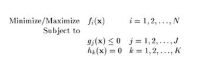
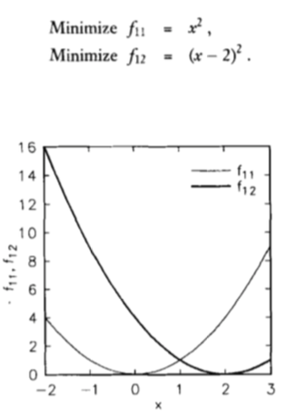
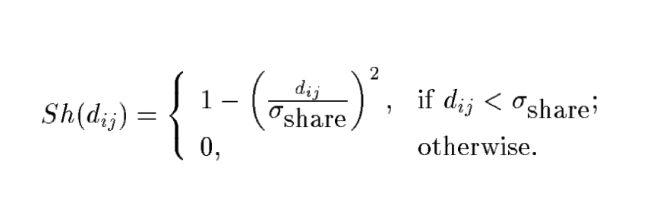

## NSGA(Nondominated Sorting in Genetic Algorithm)

> for any further information refer to [this link.](#https://web.njit.edu/~horacio/Math451H/download/SrinivasDeb_GA.pdf)

Multi-objective Optimization(MOO) has formed a large number of optimization challenges. In these types of the main idea is to find the optimal answer for a function in terms of many objectives. It could be formulated as shown in Figure 1.

<figcaption align="center">Figure 1: Multi-Objective Optimization formulation</figcaption>

 

An example is shown in Figure 2. Showing two objective functions that we are interested in minimizing both. In MOO examples, we tend to omit the possible answers that are the worst in terms of all the objectives, instead what we are looking for is to find the answers that are at least minimal in one objective. This is called as the nondomination region. In case of Figure 2, the answers have to be scattered in region [0, 2].

<figcaption align="center">Figure 2: An example for MOO</figcaption>

 

The possible answers have to be all scattered among the possible region for the answers, to achieve this, a method is used named as Niching Technique to stimulate the answers to place as far as possible. This technique is shown in Figure 3.

<figcaption align="center">Figure 3: Niching technique</figcaption>

 

An example for the case where the samples should be scattered in the nondomination region.

<figcaption align="center">Figure 4: Diversity</figcaption>

 

NSGA-i proposed by N. Srinivas, uses the sharing technique and genetic to find the best combination of the answers. However it has a high time complexity. To tackle this an approach was proposed in nsga-ii, prposed by Kalyanmoy Deb, to utilize a faster approach on categorizing the possible solutions in terms of nondomiantion. The implemented algorithm is based on nsga-i while using the nondominated sorting proposed in nsga-ii to be more efficient.
